## 上午的作业
### 作业题目
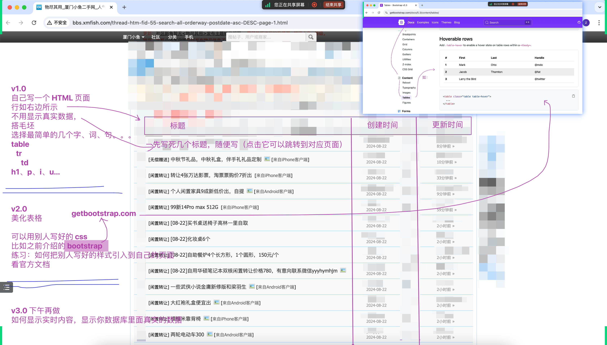
- 这个作业的背后包含复习之前的知识
  - Java 阶段项目的采集代码
  - MySQL
  - HTML + CSS + JS
  - 思想、方法...

### 解答

#### 创建新项目和远程仓库
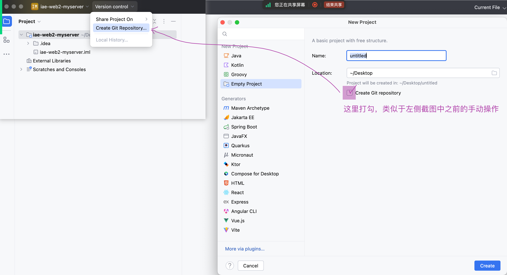

#### v1.0 - 毛坯
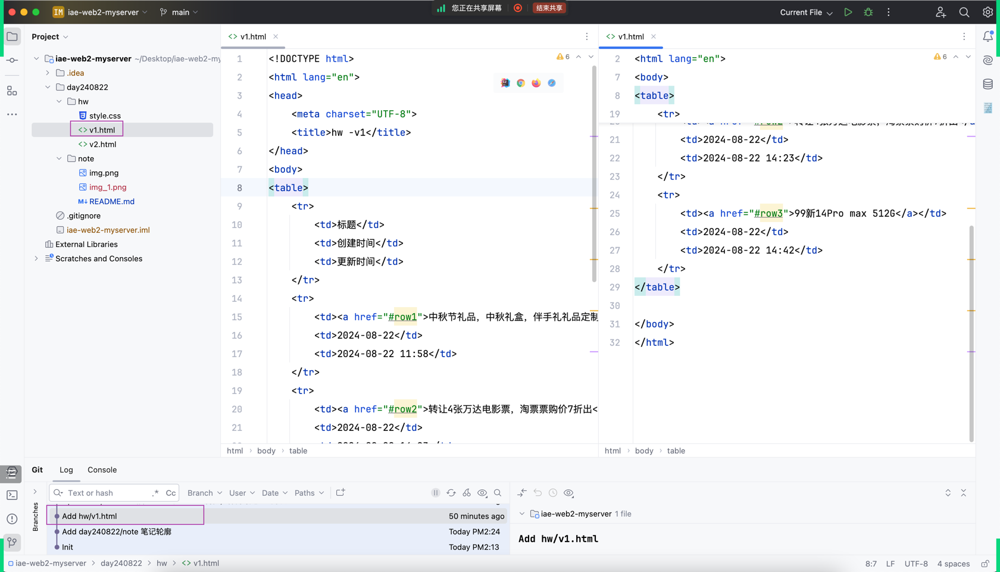
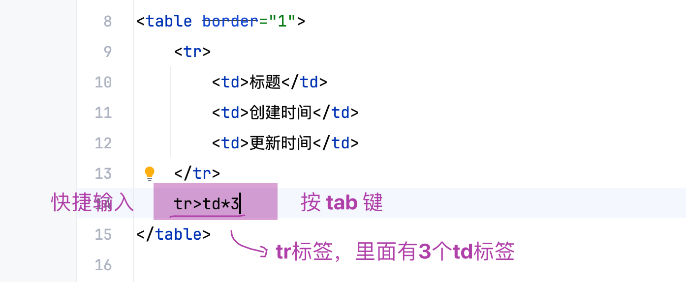
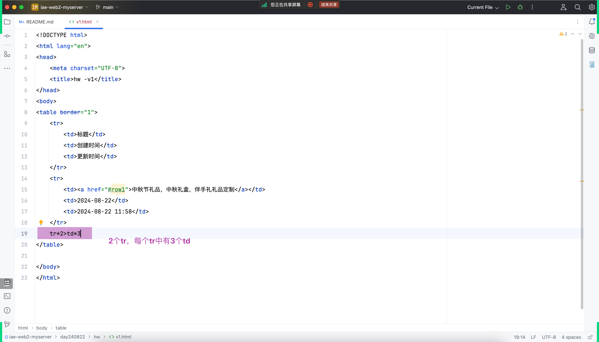

#### v2.0 - 美化：引入别人写好的 CSS 或者 JS
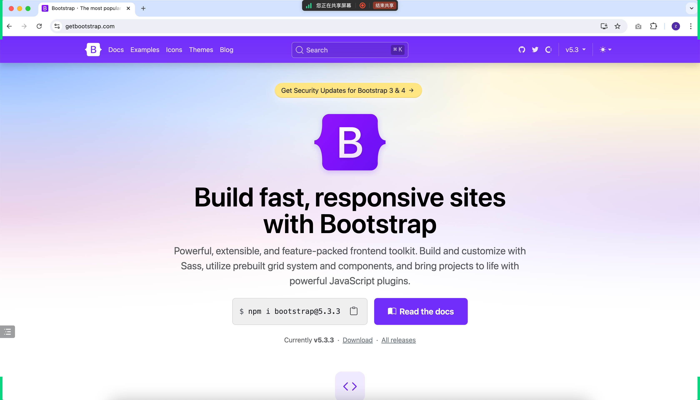
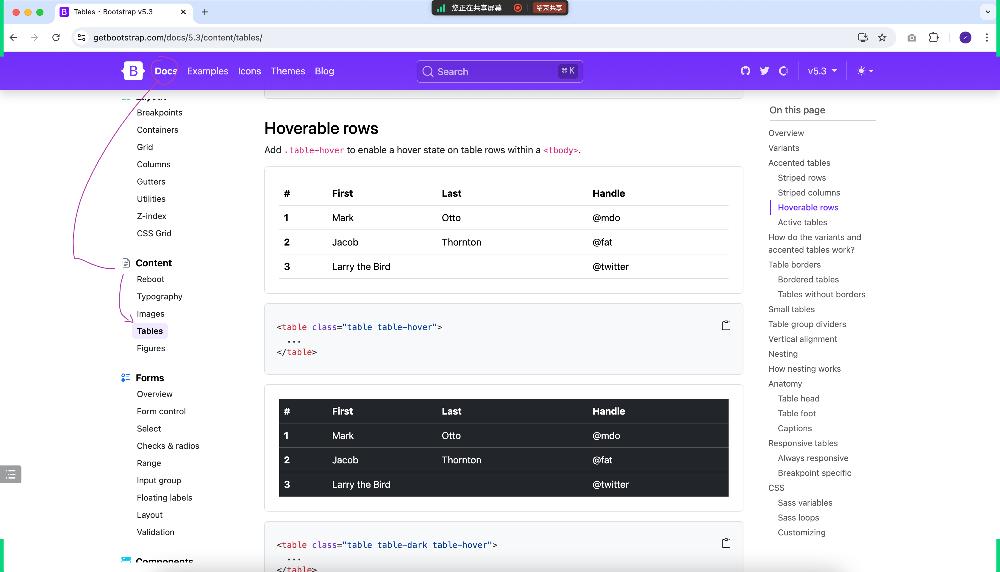

## Web 回顾
### Web 1.0 阶段的特点
- 用户只能你准备好的内容，不能互动
- 每个用户看到的都是同样的内容，不能个性化
- 你要修改源码代码才能让用户看到新的内容
- ...

### Web 不是单一技术

- 其他几个之前都接触过了，今天聚焦`HTTP协议`和`服务器`

## 直观感受 HTTP 协议

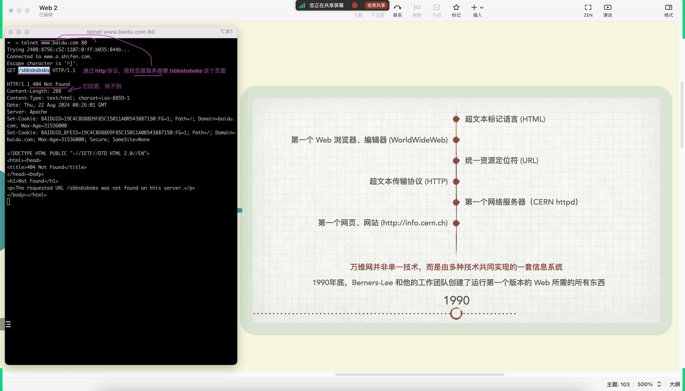

## 自己写一个最最简单的 Web 服务器
- `ServerSocket`、`Socket`、网络、IO、线程...
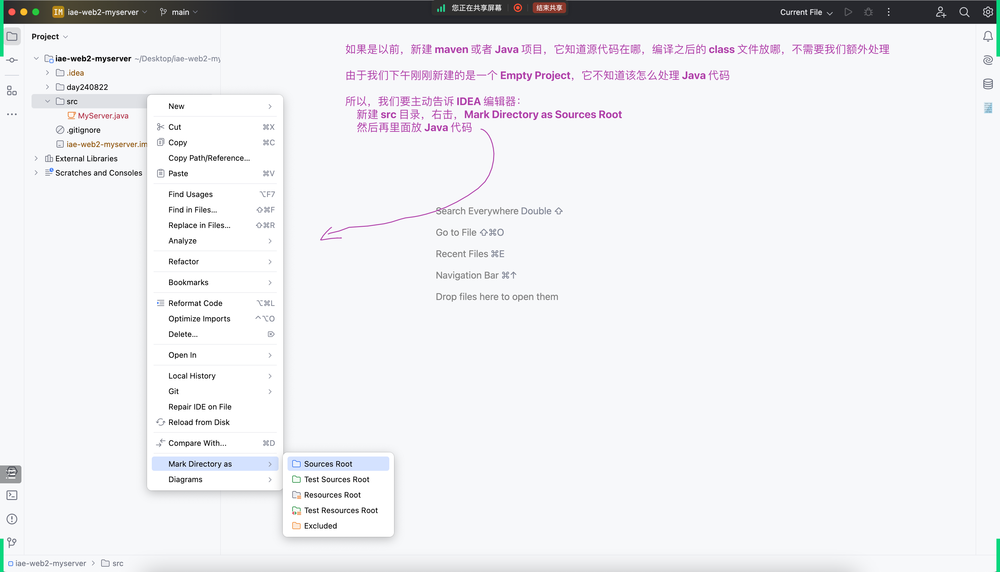
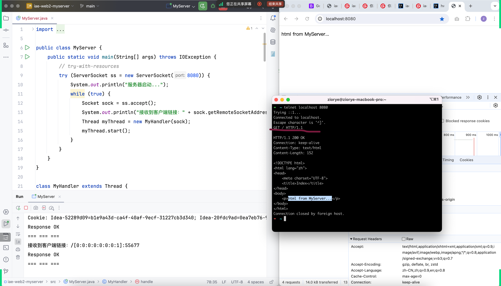
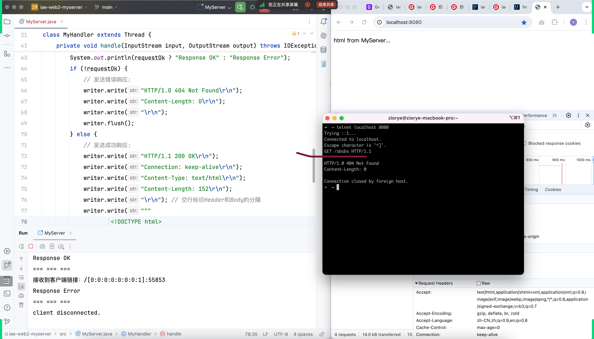
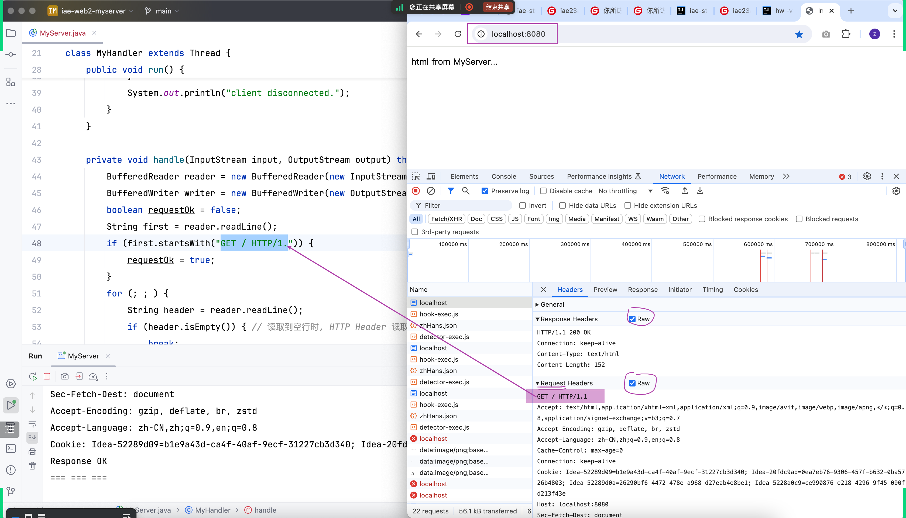
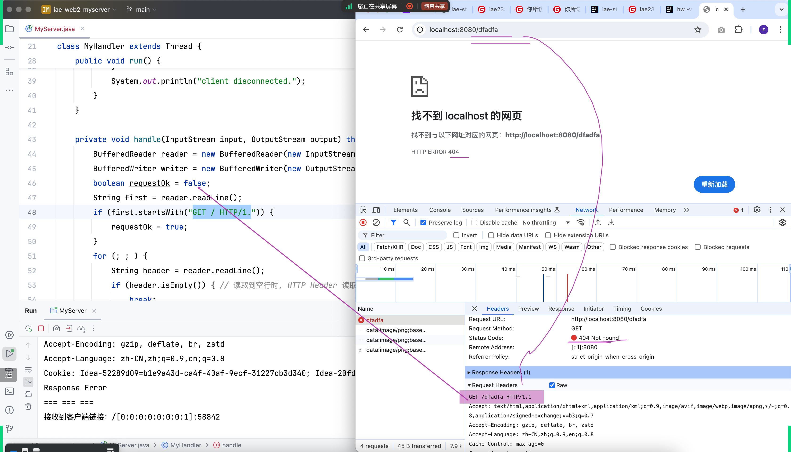
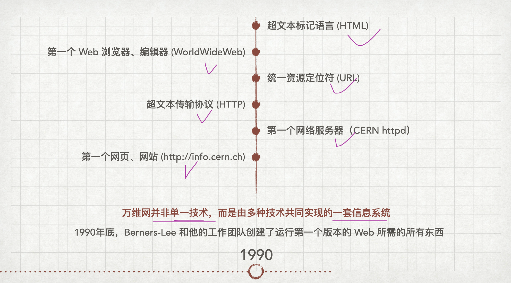

