## 上午的作业
### 作业题目
- 完成昨天的 `作业 v3.0` ，即和 `MyServer` 结合
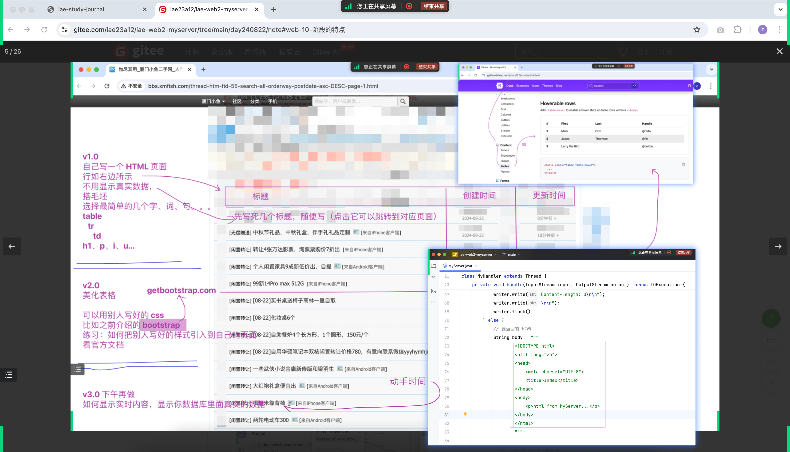
- 参考思路：
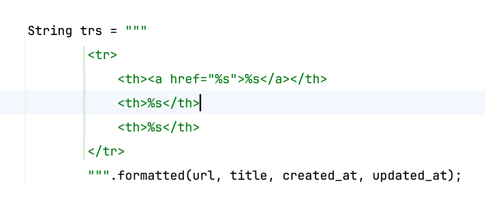
#### 完成的效果 
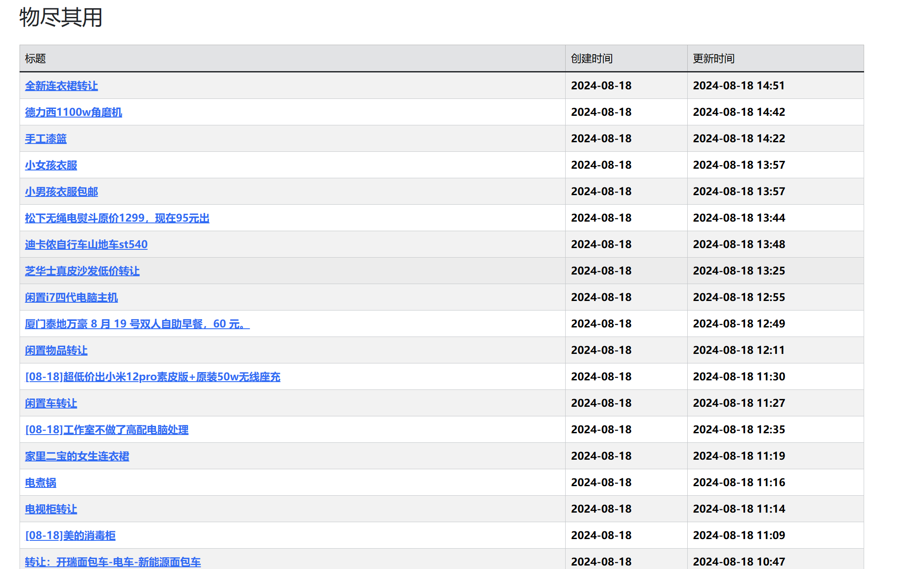

### 作业衍生
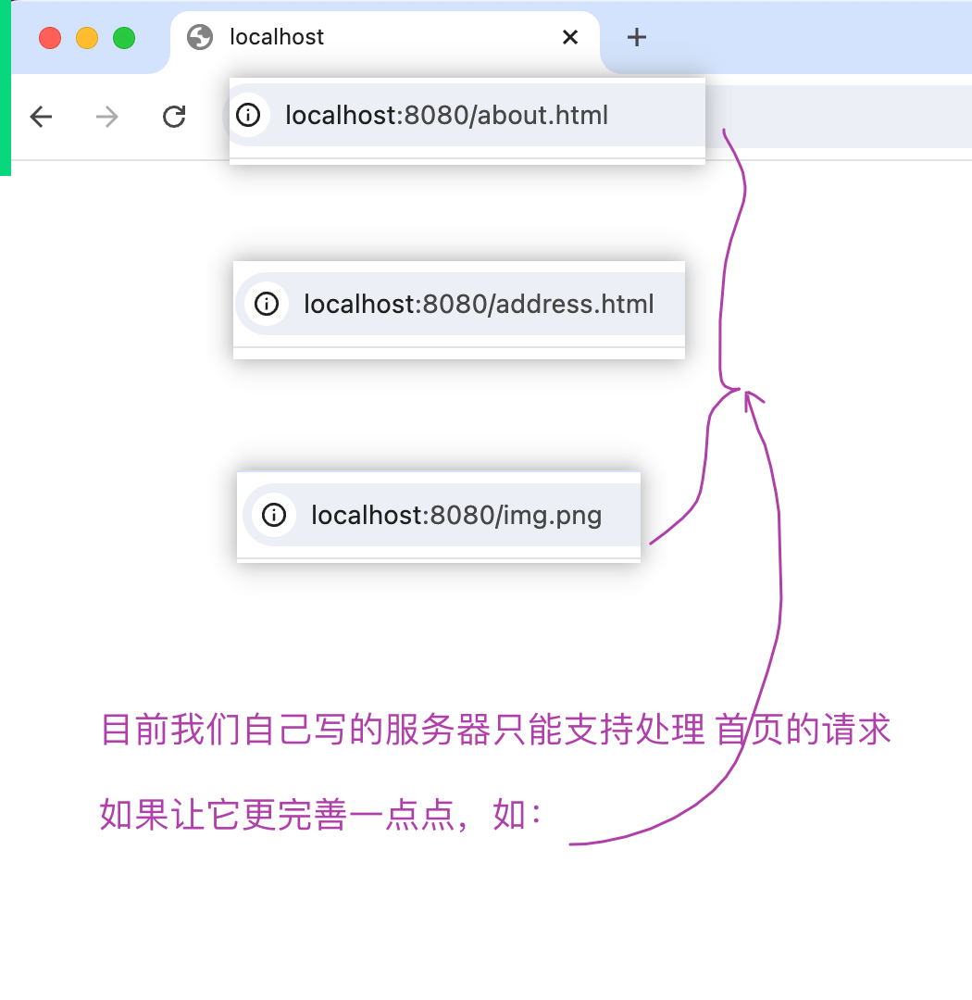
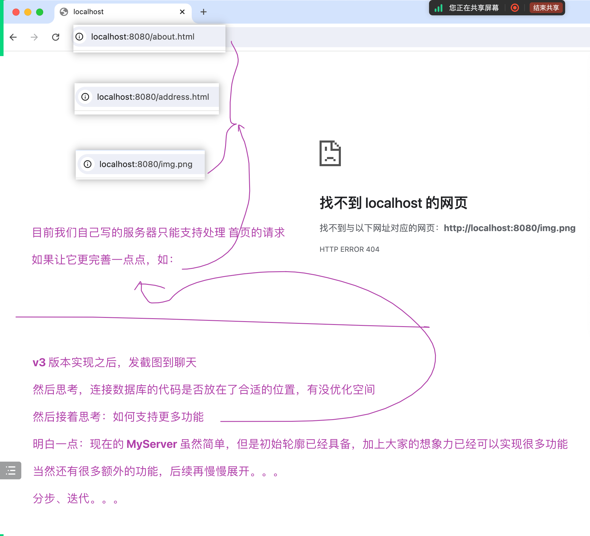
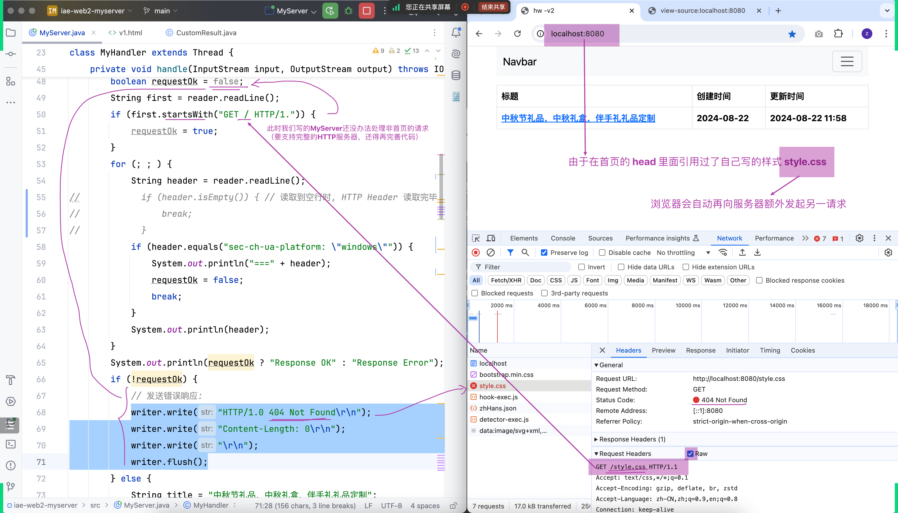

#### 请求头
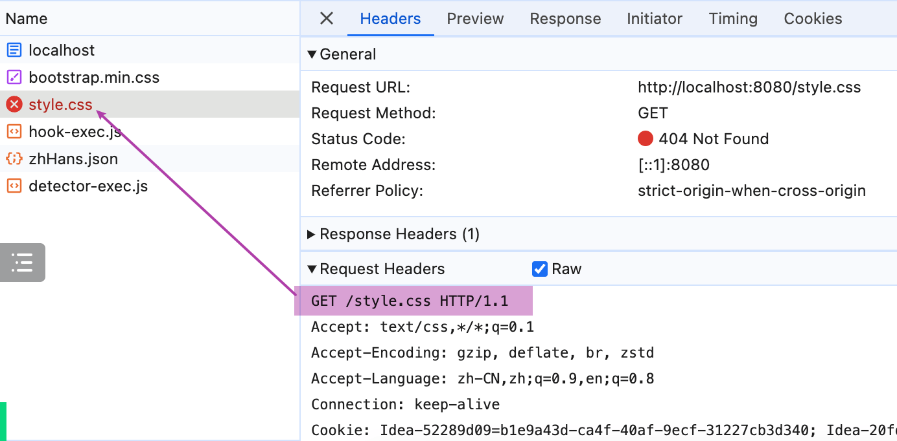
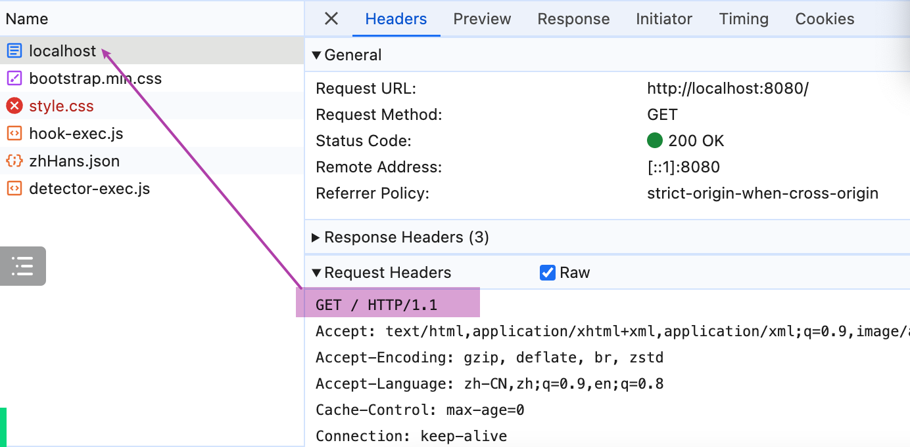
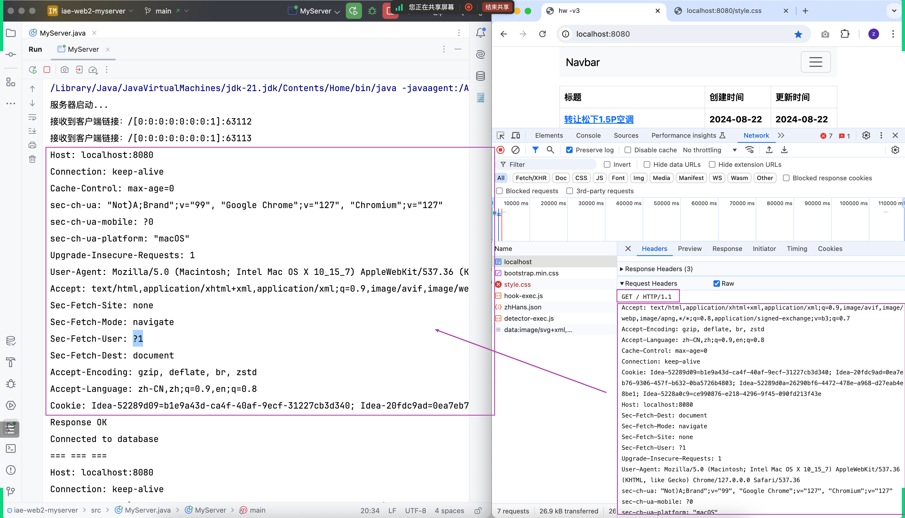

####  深入了解
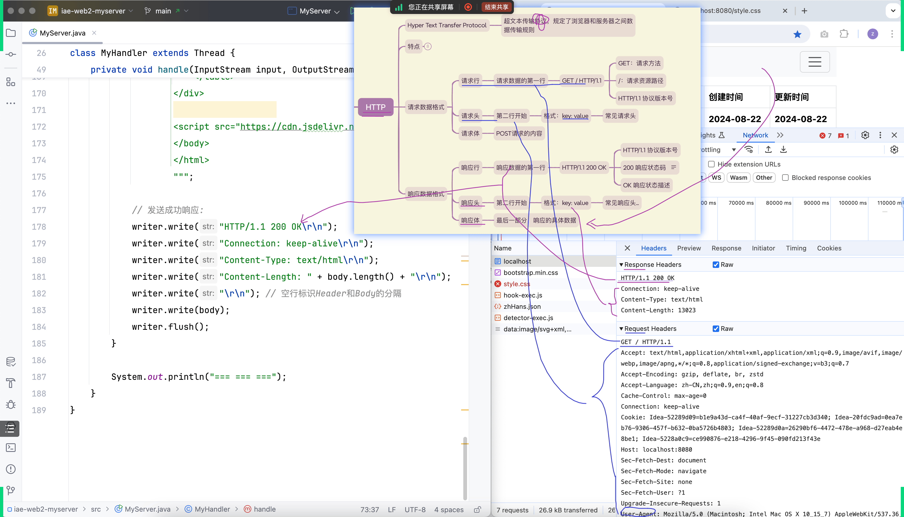

#### 完成的作业衍生
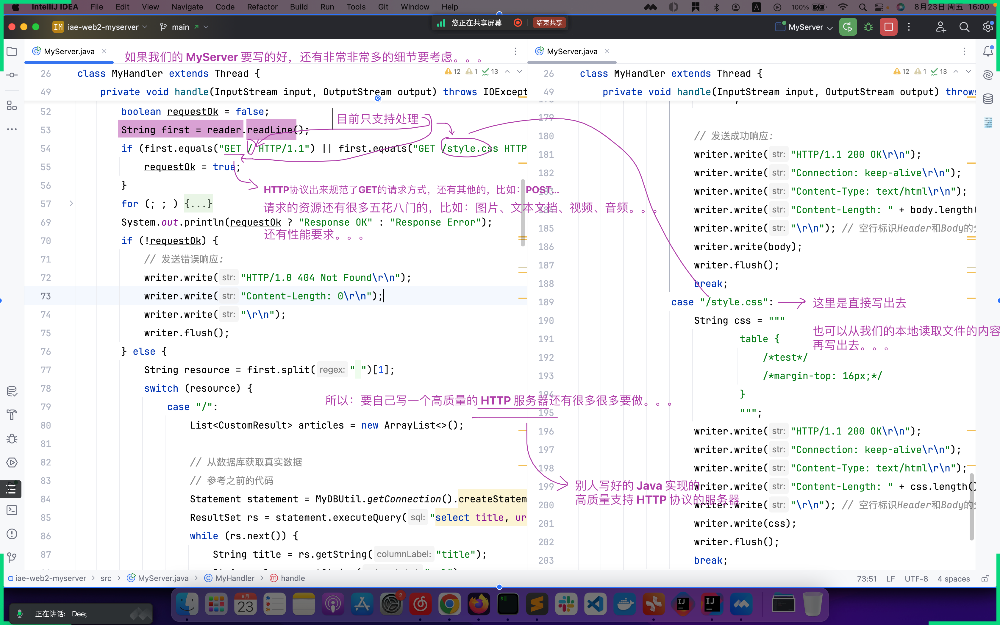
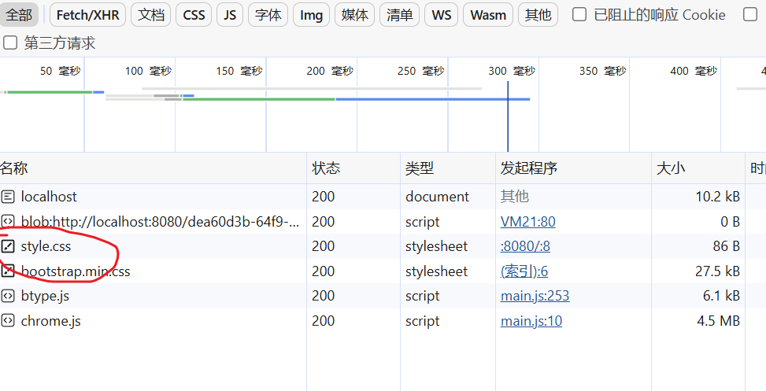

## Tomcat
- https://tomcat.apache.org/download-10.cgi
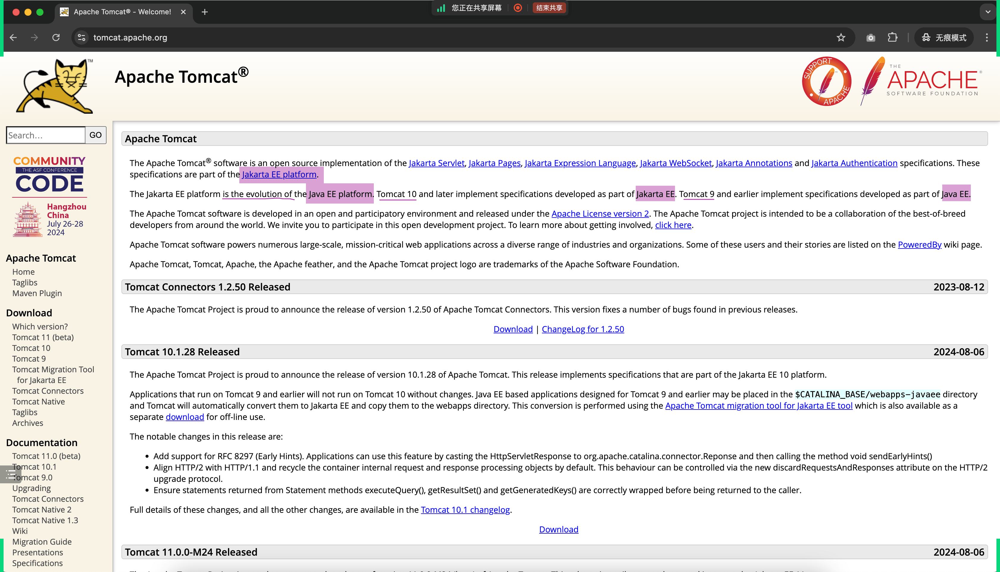

### 下载
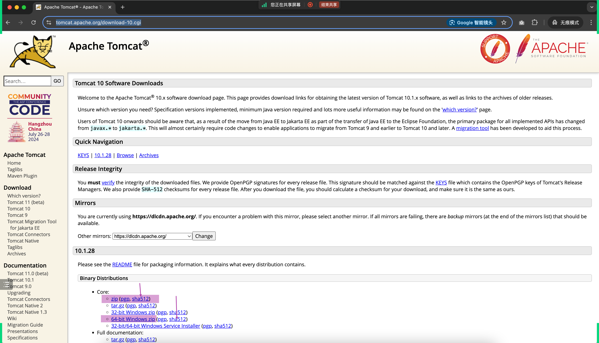

### 启动
- 先停止自己的 MyServer 程序，再启动 tomcat
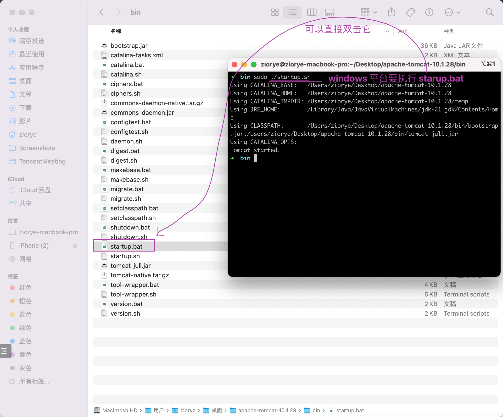
- http://localhost:8080/
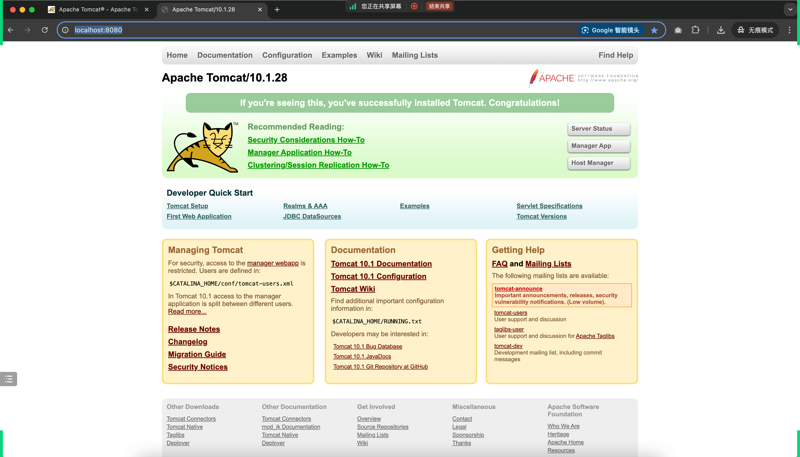

